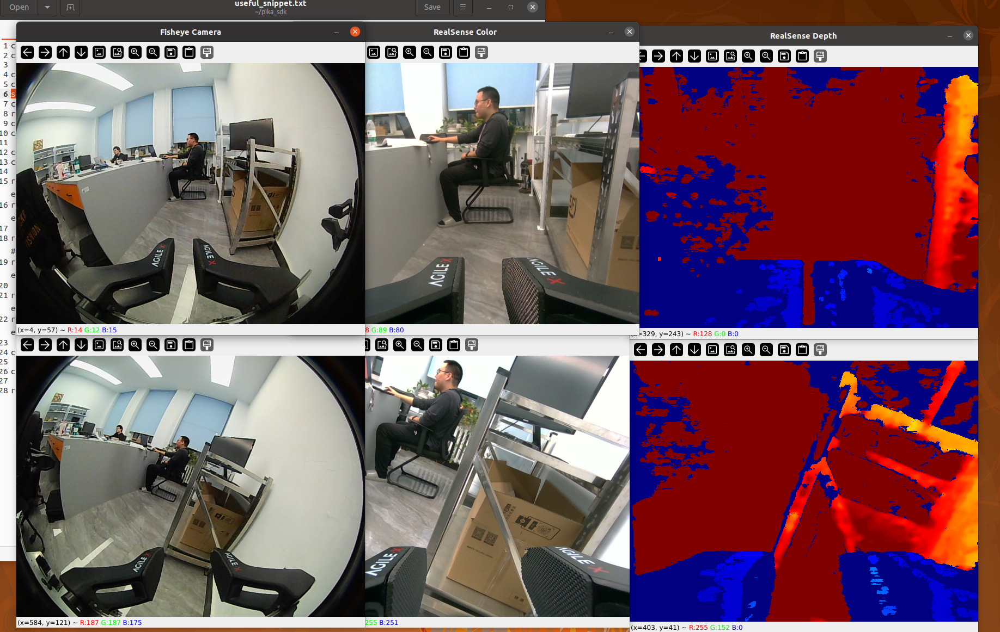
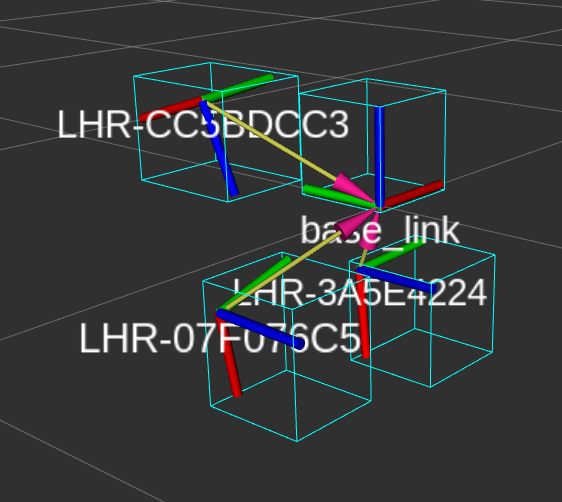
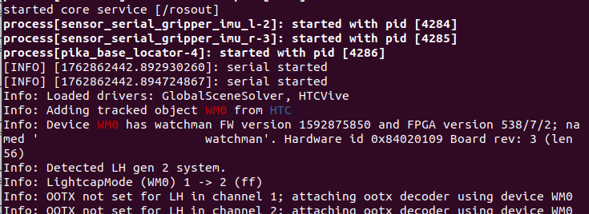
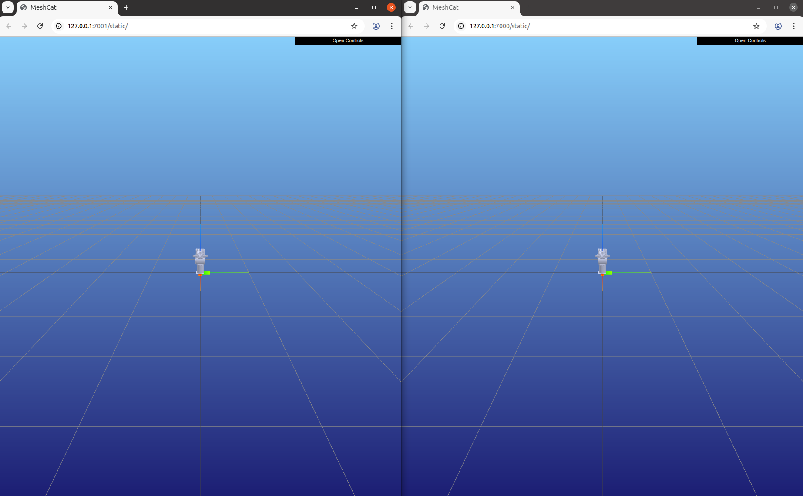

# Documentation for PieMoPER
This documentation explains how to implement **PieMoPER**.

## Guides
- [Connection](#connection)
- [Calibration](#Calibration)
- [Device Setup](#device-setup)
- [Start Teleoperation](#start-teleoperation)
- [Data Collection & Processing](#data-collection--processing)

## Connection
Before making any connections, ensure that **Pika Stations** and **Pika Senses** are fully charged.
Refer to the two figures below for an overview (note that we **do not follow** the official setup — see [Device Setup](#device-setup) for details):
<p align="center">
  
  
</p>

- Connect Pika Gripper **directly** to your laptop's USB3.0 port\*.
- Connect the Docking Station to another USB3.0 port, then attach:
	- 3× VIVE Trackers Receiver
		(2× for Pika Senses left/right trackers, 1× for base tracker — better label each receiver with a sticker)
	- 2× Pika Sense
	- 2× Pika PiPER (you may need additional ports for your robot)
\*The DEXIN fisheye camera on Pika Gripper may encounter bus jamming if connected via a docking station.

## Calibration
You must calibrate Pika Station before using VIVE trackers. Recalibration is also required if Pika Station is moved\*.

- Initial calibration:
	```bash
	cd ~/piemoper/install/lib && ./survive-cli --force-calibrate
	```
- Recalibrate if the tracking is drifting or the station is moved:
	```bash
	cd ~/piemoper/install/lib && ./survive-cli
	```

The terminal will output results like this:
<p align="center">
  
</p>

- ① Detected channels and stations
- ② Added stations
- ③ Received data packets
- ④ Current tracking error (you can close the terminal once this appears)
- ⑤ Failure count when your press Ctrl+C; should be 0 or you need to recalibrate
\*Calibration may fail or become unstable if the stations are not well-positioned or your room has strong sunlight.

## Device Setup
After connecting all devices, configure each for your computer.
This section describes how to obtain Pika device information\* and bind PiPER CAN ports. 
### Setup Pika Devices
- Detect connected cameras:
	```bash
	python3 tools/camera_detector.py # camera_detector_cn.py for Chinese prompts
	```
	Follow on-screen prompts to connect/disconnect devices.
	Note down the **realsense serial name** for the Grippers (e.g., left Gripper is `315122272588`, the right one is `315122272438`).
- Identify serial ports:
	```bash
	ls -l /dev/ttyUSB* 
	```
	Reconnect the device to see which port changes, then note down each **serial port names** (e.g., left Gripper is `ttyUSB0`, the right one is `ttyUSB1`).
- Run the device detector code again:
	```bash
	python3 tools/camera_detector.py # camera_detector_cn.py for Chinese prompts
	```
	This time, **do not disconnect any devices**, keep entering 'n' to iterate through devices and note down each video port index for Pika Gripper at the same time (e.g., left Gripper is `video4`, the right one is `video6`).
- Edit the binding test script: 
	```bash
	gedit tools/cam_bind_test_gripper.py
	```
	Modify the following lines with your noted camera information:
	```python
	# line 17
	left_name = '/dev/ttyUSB0'
	right_name = '/dev/ttyUSB1'
	left_index = 4
	right_index = 6
	left_rs_serial = '315122272588'
	right_rs_serial = '315122272438'
	```
- Then run the script to verify the binding:
	```bash
	python3 gedit tools/cam_bind_test_gripper.py
	```
	You should see **6 windows** (fisheye, RGB, and depth cameras for both left and right Pika Grippers), e.g.:

<p align="center">
  
</p>

\*The official AgileX Pika documentation uses automatic mapping scripts for binding Senses and Grippers. However, these often fail and assume each device connects to separate USB ports — requiring at least **5 USB 3.0** ports. Our approach instead uses a docking station and **manual device mapping**, which is slightly more involved but **much more reliable**. We aim to automate this process in the future.

### Setup VIVE Trackers
- Get tracker serial numbers:
	```bash
	roslaunch pika_locator get_code.launch
	```
	Note down the serial numbers for your left arm, right arm and base trackers, e.g.:

<p align="center">
  
</p>

- Bind trackers:
	```bash
	echo 'export pika_L_code=LHR-3A5E4224' >> ~/.bashrc
	echo 'export pika_R_code=LHR-07F076C5' >> ~/.bashrc
  echo 'export pika_BASE_code=LHR-CC5BDCC3' >> ~/.bashrc
	source ~/.bashrc
	```
### Setup PiPER CAN
- Connect **only the left arm PiPER**, then run:
	```bash
	cd ~/piemoper/src/PikaAnyArm/piper/piper_ros
	bash find_all_can_port.sh
	```
	Note the left arm's port (e.g., `1-3.3.2.4:1.0`).
- Connect the right arm PiPER and run the script again:
	```bash
	bash find_all_can_port.sh
	```
	Note the right arm's port (e.g., `1-3.3.2.3:1.0`).
- Edit CAN configuration:
	```bash
	gedit ~/piemoper/src/PikaAnyArm/piper/piper_ros/can_config.sh
	```
	Modify lines 111–112:
	```bash
	if [ "$EXPECTED_CAN_COUNT" -ne 1 ]; then
    declare -A USB_PORTS 
    USB_PORTS["1-3.3.2.4:1.0"]="left_piper:1000000" 
    USB_PORTS["1-3.3.2.3:1.0"]="right_piper:1000000"
	fi
	```
- Activate the configuration:
	```bash
	bash can_config.sh
	```
## Start Teleoperation
### Start Localization
- First, **disconnect** all your VIVE tracker receivers.
- Run the localization script:
	```bash
	cd ~/piemoper/scripts && bash start_triple_sensor_imu_only.bash sensor
	#Pika Senses cameras are disabled
	```

- Once the script start running, **connect** receivers one by one:
	```bash
	 left tracker (WH0) --> right tracker (WH1) --> base tracker (WH2) 
	```
	Wait for each receiver to fully connect before the next.  
	This ensures the correct binding order (`WH0`, `WH1`, `WH2`). E.g., when the terminal output messages like this:

<p align="center">
  
</p>

	This means the left tracker is marked as WH0 device, and you should connect right tracker now.
- Verify localization:
	```bash
	rostopic echo /pika_pose_l
	rostopic echo /pika_pose_r
  rostopic echo /pika_pose_base
	```
### Start Pika Gripper
- Open a new terminal, and run:
	```bash
	cd ~/piemoper/scripts && bash start_multi_gripper.bash gripper sensor
	```
	You should see camera topics for the Pika Gripper appear in RViz.
	It is normal to see a warning like:
	`WARNING [139776548136704](messenger-libusb.cpp:42) control_transfer returned error, index: 768, error: Resource temporarily unavailable, number: 11`
	Check [this link](https://github.com/IntelRealSense/realsense-ros/issues/2386#issuecomment-1161813454) for explanation.

### Start PiPER and Teleoperate
- Open a new terminal, and run:
	```bash
	roslaunch pika_remote_piper teleop_rand_multi_piper.launch
	```
	A local port simulating the PiPER model will open in your browser:

<p align="center">
  
</p>

- Now, pick up Pika Senses, adjust their poses to align with Pika Grippers, and start teleoperating by **quickly clamping the mimic gripper twice**:
<p align="center">
  
</p>

## Data Collection & Processing
All data collection and processing pipelines are configured through `.yaml` files. You can custom your own `.yaml` file to change data types.
### Data Collection
- To collect/record teleoperation data, run:
	```BASH
	roslaunch data_tools run_data_capture.launch type:=triple_pika_imu datasetDir:=$HOME/agilex/data episodeIndex:=0
	```
	If you want the data collection to **start automatically after double-clamping** the mimic gripper, use:
	```bash
	roslaunch data_tools run_data_capture.launch type:=triple_pika_imu useService:=true  datasetDir:=$HOME/agilex/data episodeIndex:=0
	```
- You should see a terminal output like this:

<p align="center">
  
</p>

### Data Processing
The recorded data can be processed in several stages: **synchronization**, **conversion**, **point cloud generation**, and **replay**.
#### Data Syncing
Synchronize the timestamps across all recorded sensors:
```bash
roslaunch data_tools run_data_sync.launch type:=triple_pika_imu datasetDir:=$HOME/agilex/data episodeIndex:=-1
```
Alternatively, you can use the Python interface:
```bash
python3 data_sync.py --type triple_pika_imu --datasetDir $HOME/agilex/data/
```
This will generate a `sync.txt` file in each sensor’s data folder (e.g.,
`/home/agilex/data/episode0/camera/color/pikaDepthCamera/sync.txt`), which aligns data across modalities.
#### Data Conversion
Convert your synchronized data into **HDF5** for efficient loading and processing.
- Convert to HDF5:
	```bash
	cd ~/pika_ros/scripts
	python3 data_to_hdf5.py --type triple_pika_imu --datasetDir $HOME/agilex/data/ --useCameraPointCloud ""
	```
- Generate point clouds:
	```bash
	cd ~/pika_ros/scripts
	python3 camera_point_cloud_filter.py --type triple_pika_imu --datasetDir $HOME/agilex/data/
	```
	Then, convert the generated point clouds into HDF5:
	```bash
	python3 data_to_hdf5.py --type triple_pika_imu --datasetDir $HOME/agilex/data/
	```
	**Note:** By default, HDF5 conversion only saves **file index references**, not the full dataset. You must keep your original data.
	To pack all the raw data into HDF5, run the following script:
	```bash
	python3 data_to_hdf5.py --type triple_pika_imu --datasetDir $HOME/agilex/data/ --useIndex "" --useCameraPointCloud "" --datasetTargetDir $HOME/agilex/data/hdf5
	```
#### Data Replaying
To replay collected data, first ensure all data are synchronized, then run:
```bash
roslaunch data_tools run_data_publish.launch type:=triple_pika_imu datasetDir:=$HOME/agilex/data/ episodeIndex:=0
```
You can also replay directly from HDF5 files:
```bash
cd ~/pika_ros/scripts
python3 data_publish.py --type triple_pika_imu --datasetDir $HOME/agilex/data/ --episodeName episode0
```
All data streams will be published as their original ROS topics.
#### Data Loading
A simple example for loading your data in your code:
```bash
python3 load_data_example.py --datasetDir $HOME/agilex/data/
```